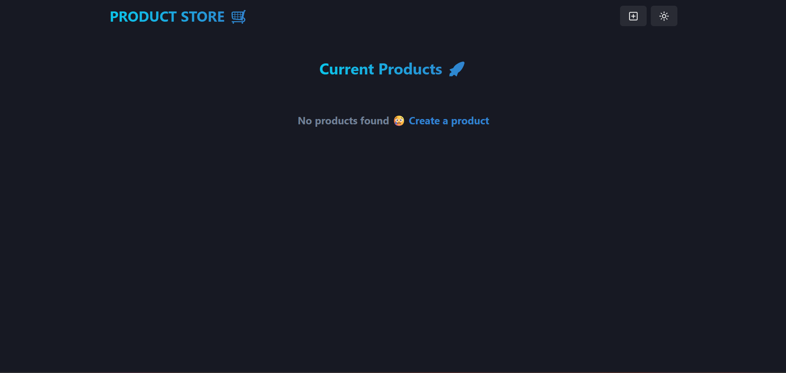
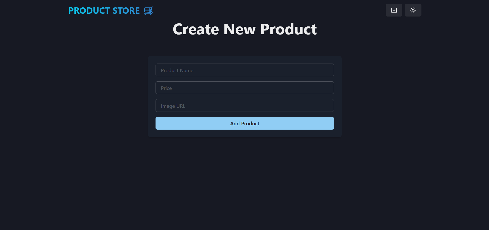
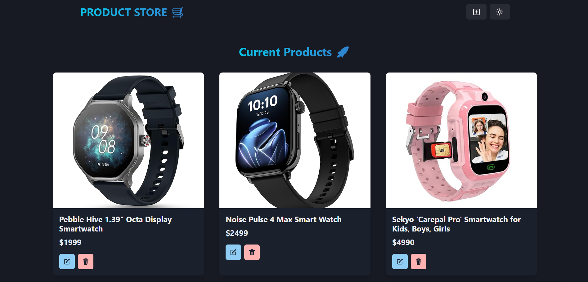

# Basic MERN Stack Project

A simple full-stack product store built with the MERN stack (MongoDB, Express, React, Node.js) and Chakra UI.

Home page: 


Update page:


Updated Home page:


## Project Structure

- **Backend/**  
  Express server, MongoDB connection, REST API for products.
  - `server.js`: Entry point, sets up Express and routes.
  - `config/db.js`: MongoDB connection logic.
  - `models/product.model.js`: Product schema/model.
  - `controllers/product.controller.js`: CRUD logic for products.
  - `routes/product.route.js`: API routes for products.

- **Frontend/**  
  React app with Chakra UI, Zustand for state management.
  - `src/`: Main React source code.
    - `components/`: UI components (Navbar, ProductCard).
    - `pages/`: Home and Create product pages.
    - `store/product.js`: Zustand store for product state and API calls.


## Getting Started

1. **Install dependencies**
   ```sh
   npm install
   cd Frontend
   npm install
   ```

2. **Set up environment**
   - Create `.env` in root with your MongoDB URI:
     ```
     MONGODB_URI=your_mongodb_connection_string
     ```

3. **Run backend**
   ```sh
   npm run dev
   ```

4. **Run frontend**
   ```sh
   cd Frontend
   npm run dev
   ```

5. **Open in browser**
   - Visit [http://localhost:5173](http://localhost:5173)

## Features

- List all products
- Create new product
- Update and delete products
- Responsive UI with Chakra UI
- State management with